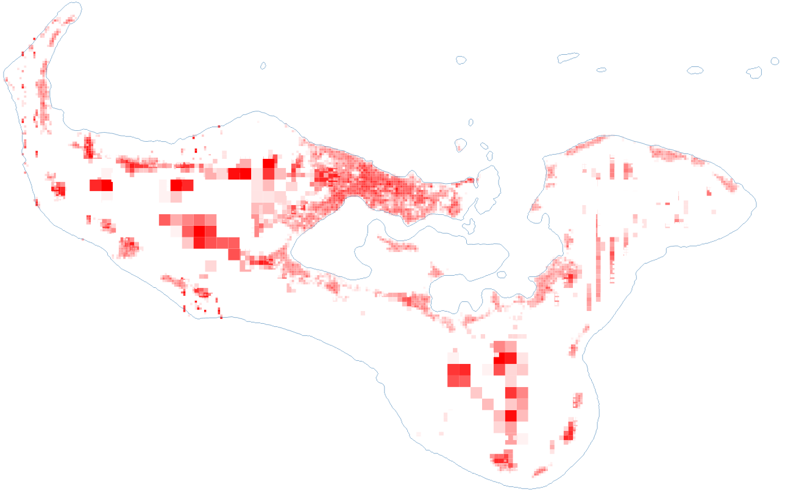

# WB/PCRAFI Building Exposure Model Toolkit for Pacific Island Countries

## Summary
Pacific Catastrophe Risk Assessment and Financing Initiative( PCRAFI) Program is a comprehensive, regional effort to increase the financial resilience to climate and disaster risks in the Pacific.

Since 2009 the SPC/WB/PCRAFI Programme has assembled one of the largest collections of geospatial information related to risk and exposure for the Pacific. These datasets, field-collected and validated in a phased manner, contains detailed and country-specific information on assets, population, hazards, and risks. The exposure database leverages remote sensing analyses, field surveys, and country specific datasets to characterize buildings (residential, commercial, and industrial), major infrastructure (such as roads, bridges, airports, ports, and utility assets), major crops, and population.

This Python toolkit processes PCRAFI-collected building and assets data to generate national-level, multi-resolution gridded exposure model consisting for a regional building classification typology and replacement costing. Validation for the generated exposure grid is conducted using offical national census data where building and roof material counts are available.

## Setup

The toolkit requires Python v3.11 and above and uses GeoPandas and NumPy libraries. 

1. Clone the repository
   
   `git clone https://github.com/PacificCommunity/building-exposure-model`

2. Install dependencies

    `pip install -U -r requirements.txt`

For Windows Platforms, install Geopandas and Numpy dependencies from the Unofficial Windows Binaries for Python Extension Packages at https://www.lfd.uci.edu/~gohlke/pythonlibs/

## Workflow

### 1. Assign Footprints to Survey Points

`1_join_footprints.py`

Join with footprints to derive floor area (from manually digitised, remotely sensed and OSM footprints)

### 2. Align and Merge Key Attributes

`2_align_attributes.py`

Identify and align attributes across field surveys (PCRAFI 2012, PCRAFI 2022) and official census building type data

### 3. Building Code Classficiation

`3_building_code_classifier.py`

<mark>**Typology => Wall Materal + Roof Material + Levels + Use Type**</mark>

|Code|Wall Material||||
|--|------------------|------------------|-----------|-----|
|SM|Fibre-cement sheet|Fibre-cement board|Metal sheet|Fibre|
|CB|Masonry|Concrete|Concrete Block||
|WO|Plywood Sheet||||
|WC|Timber Cement|Timber|Timber Board||
|TR|Traditional||||
|OT|Unknown|None|Other||

|Code|Roof Material||
|--|-------|-----------|
|SM|Unknown|Metal Sheet|
|CO|Concrete|Fibre-cement Sheets|
|OT|Others|

|Code|Levels|
|----|------|
|L|Low Rise (1 level)|
|M|Mid Rise (2 - 3 levels)|
|H|High Rise (more than 3 levels)|

|Code|Type|
|----|----|
|R|Residential|
|NR|Non-Residential|

*(see additional classifications below)*

### 4. Generate Multi-Resolution Flexible Grids 

`4_country_grid_flexible.py`

Generate flexible national-level multi-resolution grids based on population distributions *(excluding PNG)*.

- **25%** of Pacific people live within 1 km of the coast.

- **90%** of Pacific people live within 5 km of the coast.

- **97%** of Pacific people live within 10 km of the coast.

|Coastal Buffer | Grid Size |
|---------------|-----------|
| 1 km | 100 m2
| 5 km | 500 m2
|10 km | 1000m2

### 5. Populate Classification Code Statistics within Grid

`5_populate_grid_pcrafi.py`

Build Statistics of Buildng Classificaiton Typology Types and Total Floor Area within Grid. Spatially Distribute Classified Building Exposure Data to Flexible Multi-Grids using Weighted Regression

### 6. Calculate and Embed Uniform Construction Costing

`6_uniform_construction_costing.py`

Embed UCC/m2 Per Classification Code within Grid

### 7. Census-based Validation of Expsoure

`7_census_validation.py`

Build Code Classification and Statistics witin Census Admin Level 3 and validation of Grid-level Typology and Building Counts. Validate and conduct statistical checks using official census data spatially map to administrative levels (eg: villages, wards)

## Additional Classifications

1) Educational (Schools, Universities etc.)
2) Government/Public
3) Religious/Cultural 
4) Agricultural
5) Industrial (Heavy, Light)
6) Commercial (split: Retail/Trade; Offices/Services; Entertainment) 
7) Hospital/Health Buildings
8) Tourism/Hospitality 